# Catalog Frontend: сводка работы с начала проекта

> [!summary]
> Эта заметка - подробная карта frontend-части проекта `catalog`. Она собрана по текущему состоянию `../frontend`: истории коммитов, Next.js App Router routes, widgets, providers, generated API, plugin runtime, корзине, storefront cache и пользовательским сценариям.

Связанные узлы для Obsidian:

- [[Catalog Frontend]]
- [[Catalog Backend]]
- [[Next.js]]
- [[React]]
- [[TanStack Query]]
- [[Orval]]
- [[Storefront]]
- [[Product Drawer]]
- [[Cart SSE]]
- [[Catalog Plugins]]
- [[Custom Domains]]
- [[MoySklad]]

## Оглавление

- [[#1. Главная идея frontend]]
- [[#2. Хронология работы]]
- [[#3. Карта архитектуры]]
- [[#4. App Router и маршруты]]
- [[#5. Providers и состояние приложения]]
- [[#6. API слой и generated client]]
- [[#7. Storefront cache и revalidate]]
- [[#8. Главная витрина]]
- [[#9. Browser, категории, фильтры и поиск]]
- [[#10. Product drawer и product page]]
- [[#11. Product editor, создание и редактирование]]
- [[#12. Медиа, cropper и upload flow]]
- [[#13. Корзина, публичная ссылка и SSE]]
- [[#14. Header, share drawer и режим владельца]]
- [[#15. Редактирование каталога, сессии, интеграции и домены]]
- [[#16. Plugin runtime: restaurant и wholesale]]
- [[#17. SEO, metadata и аналитика]]
- [[#18. UI system и shared слой]]
- [[#19. Команды запуска]]
- [[#20. Что важно помнить дальше]]
- [[#21. Obsidian graph]]

## 1. Главная идея frontend

`frontend` - это Next.js 16 / React 19 приложение для мультикаталожной витрины. Оно работает поверх backend-а, который определяет текущий каталог по host или `x-forwarded-host`. Frontend отвечает за публичный storefront, режим владельца каталога, карточки товаров, product drawer, корзину, фильтры, загрузку медиа, редактирование каталога и подключение специальных UI-поведенческих плагинов по типу каталога.

Главная идея:

- один frontend обслуживает много каталогов;
- каталог определяется на сервере через host;
- homepage сразу получает текущий каталог, категории и популярные товары;
- обычный покупатель видит витрину, карточки, товар, корзину и share flow;
- владелец каталога после auth видит actions создания/редактирования товаров, категорий, профиля, доменов и интеграций;
- product detail может открываться как intercepting drawer или как standalone page;
- API типизируется из backend OpenAPI через Orval;
- plugin runtime позволяет подменять части UI для restaurant/wholesale и будущих типов.

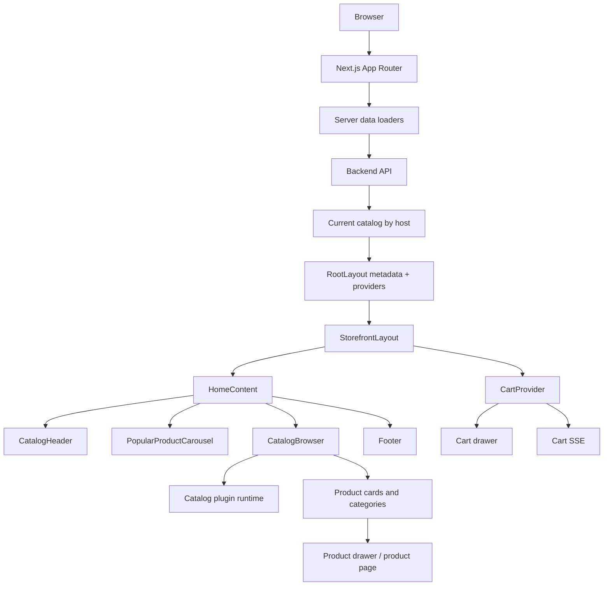

## 2. Хронология работы

> [!info]
> Хронология собрана по `git log --reverse`. Короткие коммиты `fix`, `f`, `hotfix` раскрыты по текущей структуре кода.

### Январь 2026: старт Next-приложения

26 января 2026 frontend стартовал с `Initial commit from Create Next App`, затем был коммит `init`.

На старте появились:

- Next.js App Router;
- React;
- TypeScript;
- базовая структура `app`;
- будущий фундамент для storefront.

### Февраль 2026: первые виджеты, drawer-подход и sandbox

2-4 февраля были initial commits, затем `feature: header init` и `feature: confirm init`.

15 февраля проект получил:

- полноценную стартовую структуру;
- `header widget`;
- intercepting route для product drawer.

16 февраля drawer route стабилизировали.

17-19 февраля появился alpha sandbox, тесты sandbox-подхода и адаптация под типы каталогов.

23 февраля был добавлен browser component - будущая основа главной витрины.

Итог февраля:

- появился [[Catalog Header]];
- появился [[Confirmation UI]];
- сформировался drawer UX;
- появился sandbox/plugin эксперимент;
- началась адаптация UI под разные типы каталогов.

### Март 2026: browser, animation, product drawer, refactor, МойСклад

4 марта добавлена scroll-animation.

9 марта был подтянут/доработан product drawer.

12 марта проведен refactor code.

24 марта появилась МойСклад-интеграция на frontend: UI управления интеграцией, статус, запуск sync, действия у товаров.

30 марта `pre release 0.9.0`.

Итог марта:

- storefront стал ближе к реальной витрине;
- product drawer стал центральным UX для товара;
- UI начал общаться с backend generated API;
- появилась интеграционная панель МойСклад.

### Апрель 2026: релиз, wholesale, catalog mode, production fixes

6 апреля коммит `feat: release 1.0.1`.

10 апреля добавлен spinbox для wholesale - это стало первым явным примером plugin-specific UI.

12 апреля добавлен catalog-mode: доставка/самовывоз/режимы отображения, связанные с catalog settings.

16-23 апреля шли prerelease/hotfix/fix правки, включая host-related fix 23 апреля.

20 апреля был важный UX/production change: `feat: change Image by img`. Это похоже на сознательный отказ от `next/image` в пользу обычного `img` для сценариев, где динамические внешние медиа и object storage проще контролировать напрямую.

28 апреля релизные и catalog fixes.

29 апреля удалили виртуализацию TanStack в одном из проблемных мест (`fix: delete virtualize tanstack`), затем шла серия стабилизаций.

Итог апреля:

- приложение стало production-oriented;
- wholesale получил свой cart input;
- host/forwarded-host сценарии были доведены до рабочего состояния;
- viewport, drawer, filters, categories и catalog state активно стабилизировались.

### Май 2026: custom domains, cache, финальная стабилизация

5 мая добавлена возможность пользователю добавлять custom domain.

5-6 мая шла серия fix-коммитов вокруг этой функциональности и смежных flow.

К 9 мая frontend содержит:

- drawer для доменов;
- Next route для revalidate storefront cache;
- server-side data loaders с cache tags;
- cart SSE;
- plugin runtime;
- product editor с image crop/upload flow;
- catalog profile editor;
- integration drawers;
- session management drawer.

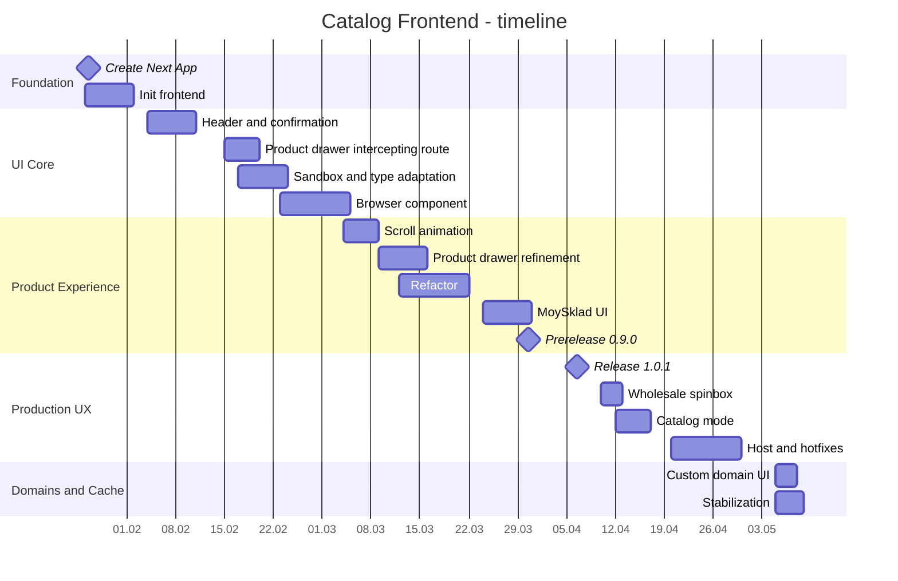

## 3. Карта архитектуры

Основные директории:

- `app/` - App Router, layouts, pages, API route revalidate, error pages;
- `core/` - доменные modules, widgets, views;
- `shared/` - API client, generated API, providers, hooks, lib, UI primitives;
- `sandbox/` - plugin runtime и плагины каталогов;
- `public/` - ассеты, шрифты, texture, fallback images;
- `w-old/` - архив старой версии, не активная часть.

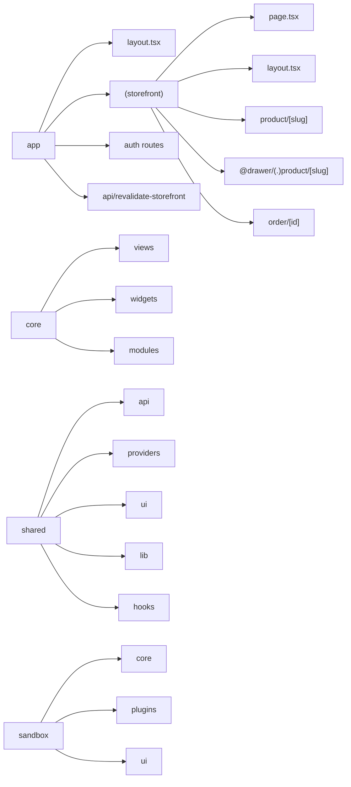

Feature layering:

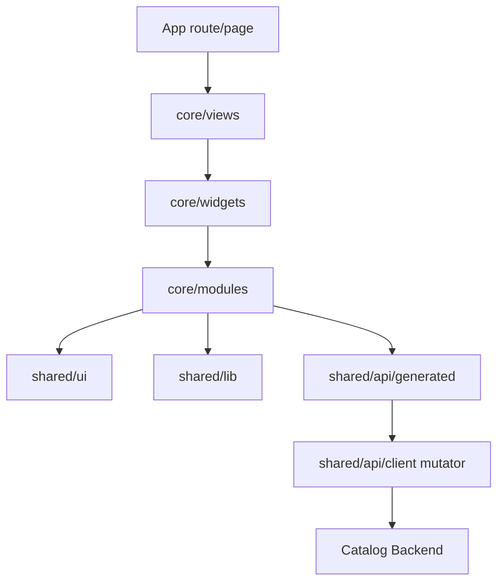

## 4. App Router и маршруты

Текущие routes:

- `/` - storefront home;
- `/product/[slug]` - standalone product page;
- intercepting route `@drawer/(.)product/[slug]` - открытие товара drawer-ом поверх homepage;
- `/order/[id]` - страница заказа;
- `/auth/login` и `/auth/sign-in` - auth pages;
- `/api/revalidate-storefront` - Next API route для инвалидирования storefront cache;
- global `error.tsx`, `global-error.tsx`, `not-found.tsx`.

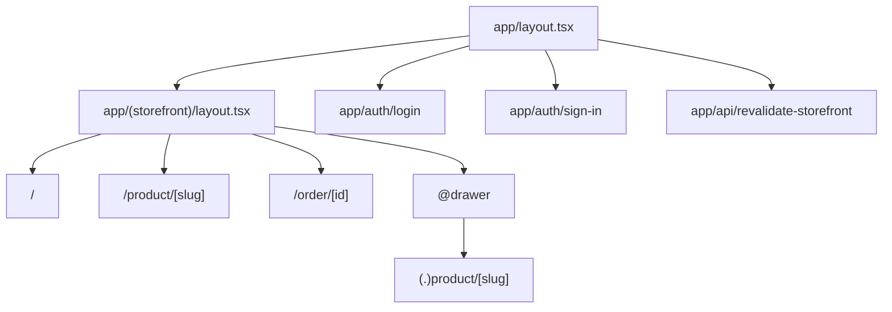

Product navigation:

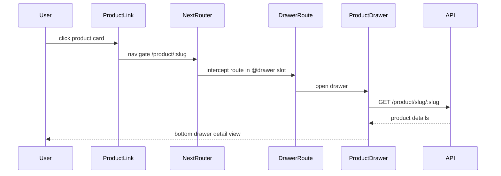

Если пользователь открывает прямую ссылку `/product/[slug]`, он попадает на standalone page, а не на overlay.

## 5. Providers и состояние приложения

`app/layout.tsx` делает server bootstrap:

- загружает текущий каталог через `getCurrentCatalogServer`;
- получает forwarded host;
- строит metadata;
- получает начальную session;
- добавляет structured data;
- подключает Yandex Metrika counters;
- оборачивает приложение в `AppProvider`.

`AppProvider` включает:

- `ReactQueryProvider`;
- `SessionProvider`;
- `CatalogProvider`;
- `SubscriptionAccessGate`;
- iOS scroll fix.

`StorefrontLayout` дополнительно включает:

- `DrawerCoordinatorProvider`;
- `CartProvider`;
- `PluginProductDrawerInstantHost`;
- parallel drawer slot.

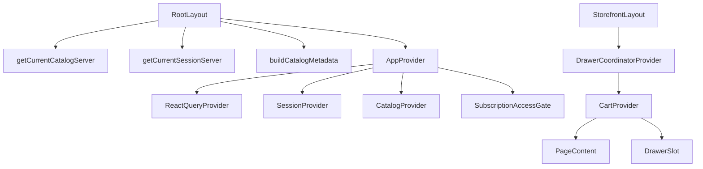

CatalogProvider:

- хранит текущий каталог;
- нормализует contacts;
- группирует contacts по типу;
- сохраняет `catalog_id` в localStorage с учетом host;
- различает `loading`, `ready`, `missing`, `error`.

SessionProvider:

- читает наличие csrf/admin csrf cookie;
- делает `/auth/me` через generated hook;
- не сбрасывает сессию только потому, что JS не видит HttpOnly/cross-domain cookie;
- очищает session state только по реальному 401;
- слушает успешные auth mutations и синхронизирует session.

## 6. API слой и generated client

API работает через Orval и общий axios mutator.

`orval.config.ts` генерирует:

- React Query hooks: `shared/api/generated/react-query/index.ts`;
- Zod schemas: `shared/api/generated/zod/index.ts`;
- plain axios functions: `shared/api/generated/axios/index.ts`.

Все запросы идут через `shared/api/client.ts`, где:

- создан axios instance;
- включен `withCredentials`;
- добавляется `x-forwarded-host`;
- добавляется CSRF header для write-запросов;
- JSON content-type ставится автоматически;
- ошибки нормализуются в `ApiClientError`;
- response 204 мапится в `undefined`.

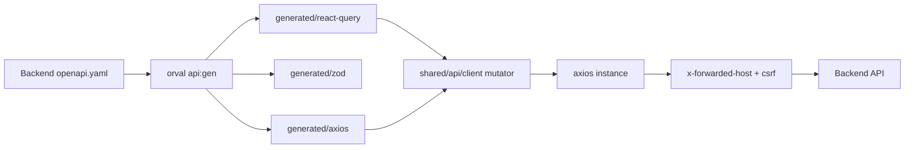

Forwarded host важен, потому что frontend может быть открыт на одном host, а backend должен понять текущий каталог так же, как в production через Caddy.

## 7. Storefront cache и revalidate

Server-side loaders используют `unstable_cache`.

`getCurrentCatalogServer`:

- получает host из `x-forwarded-host` или `host`;
- fallback берет `NEXT_PUBLIC_FORWARDED_HOST`;
- делает `/catalog/current`;
- кеширует результат на 15 секунд;
- использует cache tag по host.

`getHomePageDataServer`:

- берет categories;
- берет popular product cards;
- использует `Promise.allSettled`, чтобы частичная ошибка не ломала весь homepage;
- кеширует по host на 15 секунд.

`/api/revalidate-storefront`:

- проверяет CSRF cookie/header через `timingSafeEqual`;
- получает uncached session;
- разрешает revalidate только manager/admin роли;
- инвалидирует cache tags текущего host.

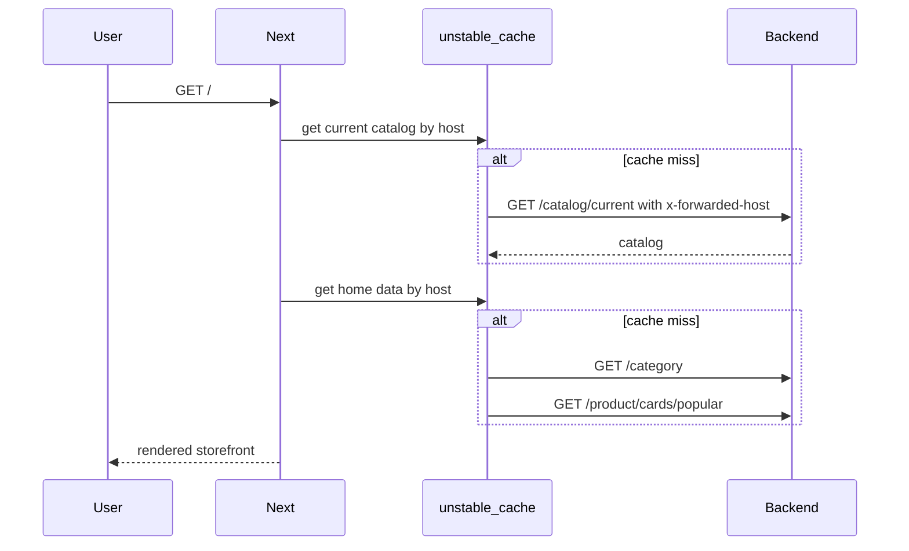

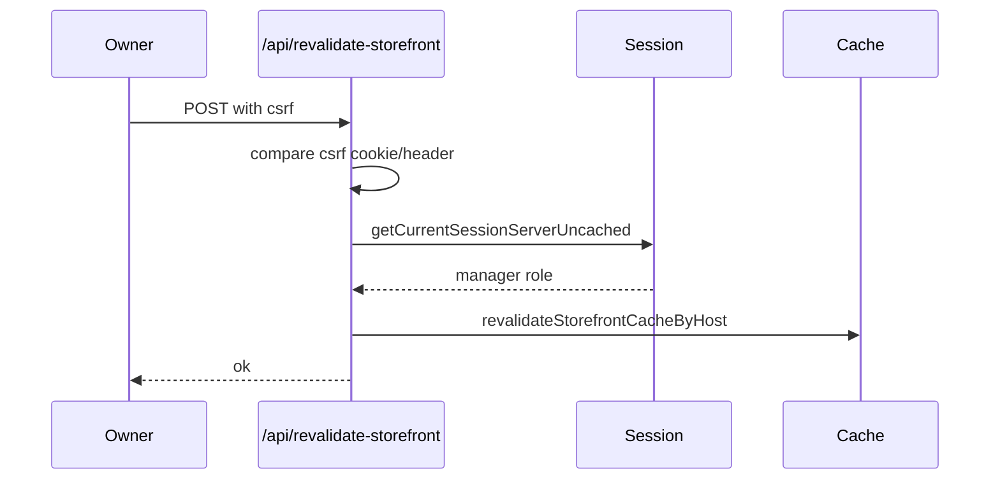

## 8. Главная витрина

`HomeContent` собирает первый экран:

- `BackgroundImage`;
- `CatalogHeader`;
- `PopularProductCarousel`;
- `CatalogBrowser`;
- `Footer`;
- `PluginCartDrawer`;
- `PluginEditProductDrawerHostProvider`.

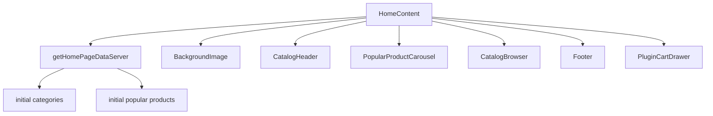

UX-идея:

- публичный пользователь сразу видит профиль каталога, популярные товары, категории и товары;
- владелец после login видит actions управления;
- тяжелые drawer-компоненты подключаются lazy/dynamic;
- server data дает быстрый first render, React Query потом поддерживает актуальность.

## 9. Browser, категории, фильтры и поиск

`Browser` - главный интерактивный каталог.

Он умеет:

- переключаться между вкладками `Каталог` и `Категории`;
- показывать sticky filter bar;
- искать товары;
- открывать drawer фильтров;
- считать active filters;
- показывать category bar;
- подсвечивать active category через intersection observer;
- блокировать конфликт между click-scroll и observer activation;
- показывать products panel;
- показывать category cards;
- открывать category admin drawers для manager role;
- отключать brand-фильтры для типов, где бренды не поддерживаются.

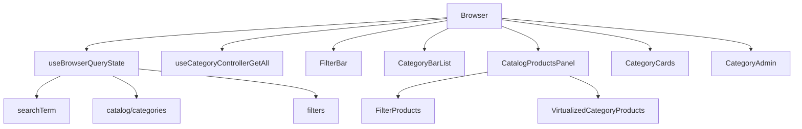

Product listing logic:

- если фильтр активен, рендерится `FilterProducts`;
- если фильтра нет, рендерятся секции товаров по категориям;
- skeleton sections показываются пока categories грузятся;
- card view mode переключается между grid и detailed layout.

## 10. Product drawer и product page

Product drawer - один из центральных UX-элементов.

Компоненты:

- `ProductLink`;
- `ProductDrawerRoute`;
- `ProductDrawer`;
- `ProductDetailsPanel`;
- `ProductDrawerInstantHost`;
- `ProductStandalonePage`;
- server helpers `get-product-by-slug.server.ts`, `product-page.server.ts`;
- view model builder `product-drawer-view.ts`.

Drawer получает:

- `productSlug`;
- optional initial product;
- preview product;
- supportsBrands;
- open/onOpenChange;
- close strategy.

Внутри:

- generated query `useProductControllerGetBySlug`;
- fallback на preview, если full product еще грузится;
- `buildProductDrawerViewModel`;
- image carousel;
- price/discount;
- brand;
- details panel;
- variants summary;
- share actions;
- cart footer action, если catalog использует cart UI.

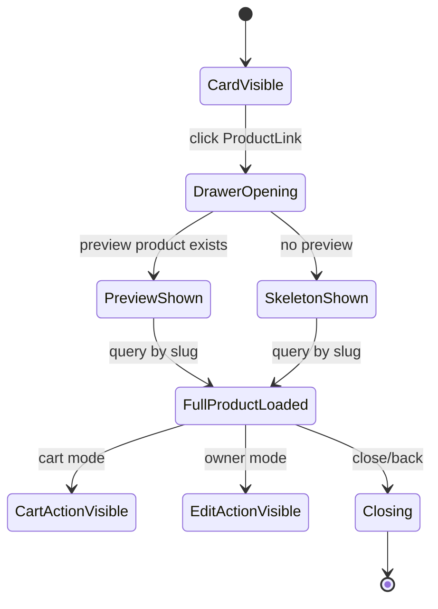

## 11. Product editor, создание и редактирование

Product editor вынесен в `core/modules/product/editor`, а create/edit drawers используют общий editor UI.

Слои:

- `ProductEditorDrawerContent`;
- form config;
- product attributes parsing;
- product variants;
- image editor shared state;
- create product drawer;
- edit product drawer;
- upload helpers;
- validation.

Create flow:

1. Пользователь открывает drawer создания товара.
2. Форма строится по type schema и attributes.
3. Пользователь добавляет изображения.
4. Если нужен первичный crop, drawer не даст сохранить без crop.
5. Форма валидируется.
6. Drawer закрывается, а сохранение продолжается в background toast.
7. Изображения ставятся в upload queue.
8. Создается товар с `mediaIds`.
9. Query cache инвалидируется.
10. Если backend еще обрабатывает фото, frontend polling-ом ждет job.
11. После обработки снова инвалидирует queries.

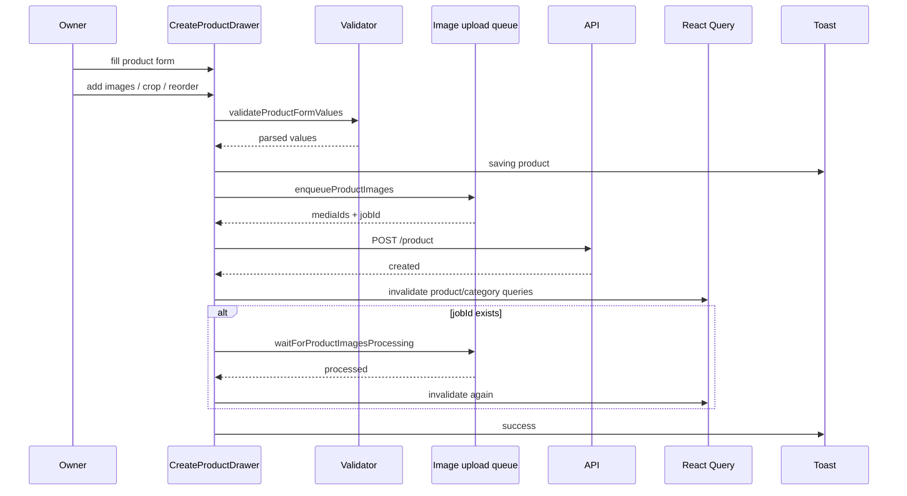

Редактирование товара использует похожую архитектуру:

- drawer host state;
- submit hook;
- image editor state;
- existing product media;
- reorder/swap/crop/remove;
- cache invalidation after mutation.

## 12. Медиа, cropper и upload flow

Frontend поддерживает богатый image workflow:

- `image-cropper-drawer`;
- cropper navigation/status;
- single image cropper field;
- preview entries;
- file reorder;
- swap image;
- required crop;
- upload progress toast;
- category image upload;
- catalog logo/bg upload;
- product images upload.

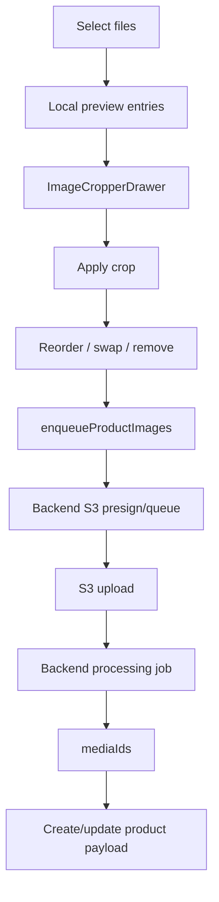

Важная UX-деталь: создание товара может закрыть drawer и продолжить работу в фоне, чтобы пользователь не сидел в заблокированном интерфейсе. Прогресс показывается через `sonner` toast.

## 13. Корзина, публичная ссылка и SSE

Cart frontend - отдельная система с current mode и public mode.

`CartProvider` хранит:

- текущую корзину;
- public access;
- режим current/public;
- manager session;
- состояние hydration;
- optimistic updates;
- totals;
- quantityByProductId;
- flags: `isPublicMode`, `isOwnSharedCart`, `isManagedPublicCart`, `canCreateManagerOrder`, `shouldUseCartUi`.

Основные сценарии:

- создать/получить текущую корзину;
- добавить товар;
- увеличить/уменьшить quantity;
- задать quantity напрямую;
- удалить item;
- очистить корзину;
- подготовить share order;
- открыть public cart;
- manager start;
- manager heartbeat;
- manager release;
- manager complete;
- detach public cart.

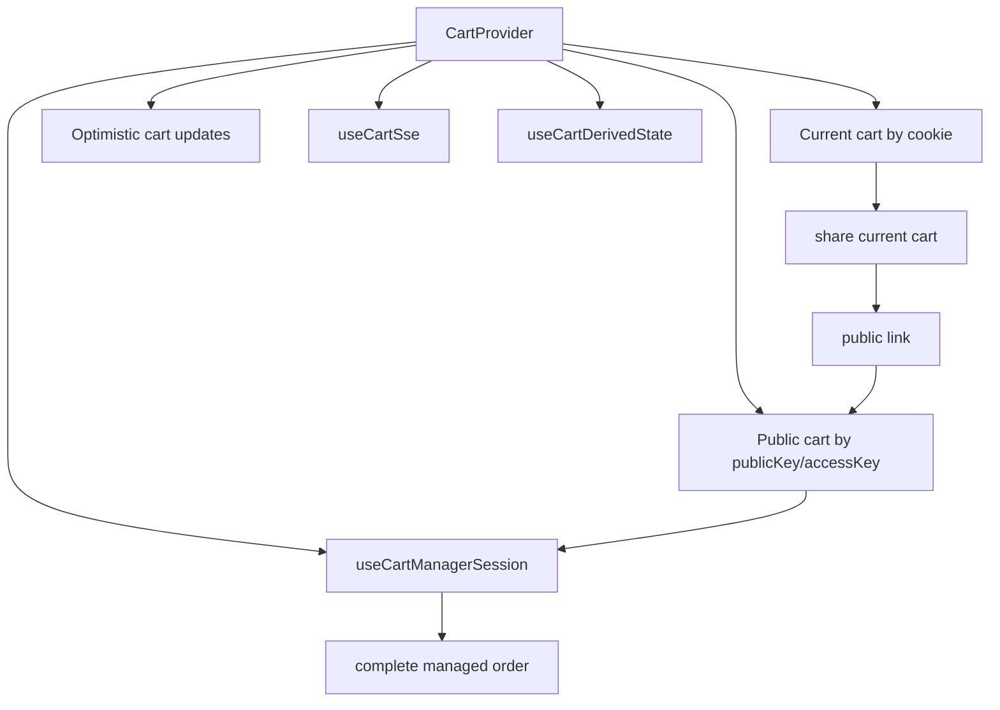

SSE:

- current cart stream;
- public cart stream;
- reconnect with exponential backoff + jitter;
- stale timeout abort;
- Redis stream event id support;
- snapshot/update/status/detached/ping event handling;
- toast notifications for remote changes;
- skips duplicate notification during local mutation.

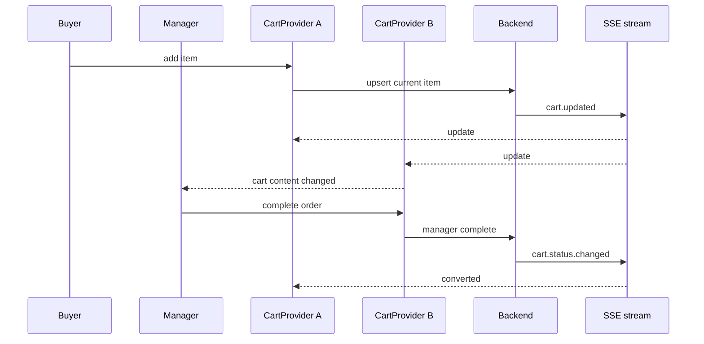

## 14. Header, share drawer и режим владельца

`Header` отображает catalog profile:

- logo;
- name;
- about;
- description;
- fallback тексты;
- share action для публичного пользователя;
- create product для владельца;
- edit catalog для владельца;
- logout;
- copy catalog link;
- statistics placeholder/action.

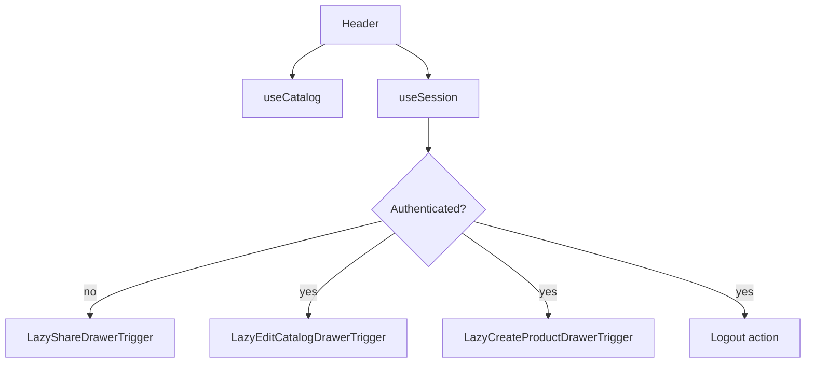

Share drawer состоит из:

- brand area;
- header;
- social list;
- action tiles;
- confirm content;
- lazy trigger.

Он использует публичные ассеты:

- `ui-share-wa-icon.svg`;
- `ui-share-tg-icon.svg`;
- `ui-share-phone-icon.svg`.

## 15. Редактирование каталога, сессии, интеграции и домены

`EditCatalogDrawer` - главный drawer управления профилем каталога.

Внутри экосистемы edit catalog есть:

- базовая форма профиля;
- logo/bg media fields;
- contacts drawer;
- contact row/icons preview;
- password drawer;
- sessions drawer;
- experience mode drawer;
- integrations drawer;
- MoySklad drawer;
- MoySklad admin/catalog variants;
- custom domains drawer.

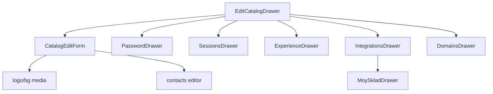

Custom domains drawer:

- показывает список доменов;
- создает домен;
- проверяет DNS;
- отключает домен;
- показывает DNS records;
- копирует name/value;
- показывает status badges;
- показывает last check и next check;
- умеет `includeWww`.

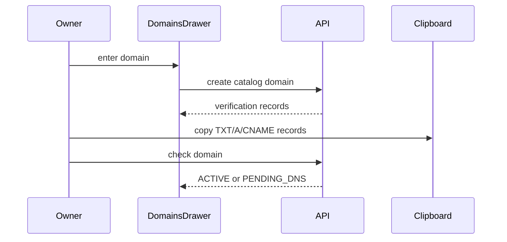

MoySklad UI:

- показывает статус интеграции;
- проверяет подключение;
- сохраняет настройки;
- запускает sync;
- отображает runs;
- может синхронизировать один товар через product action;
- умеет invalidate integration/product queries.

## 16. Plugin runtime: restaurant и wholesale

`sandbox/core` фактически стал plugin runtime:

- `contracts.ts` описывает `CatalogPlugin`;
- `registry.ts` регистрирует плагины;
- `useCatalogPlugin` выбирает plugin по `catalog.type.code`;
- `useCatalogPluginRuntime` возвращает slots;
- `CatalogBrowser` и `PluginCartDrawer` используют slots.

Сейчас зарегистрированы:

- `restaurantPlugin` для `restaurant` и `cafe`;
- `wholesalePlugin` для `wholesale` и `whosale`.

Restaurant:

- заменяет browser;
- использует restaurant-specific filter bar;
- поиск всегда inline;
- стандартная корзина.

Wholesale:

- оставляет стандартный browser;
- заменяет cart card action на spinbox;
- удобно для оптового ввода quantity 1-999.

```mermaid
flowchart TD
    CatalogProvider --> TypeCode[catalog.type.code]
    TypeCode --> UsePlugin[useCatalogPlugin]
    UsePlugin --> Registry[CATALOG_PLUGINS]
    Registry --> Restaurant[restaurant/cafe plugin]
    Registry --> Wholesale[wholesale plugin]

    Restaurant --> BrowserSlot[custom Browser]
    Wholesale --> CartSlot[custom cart CardAction]
    BrowserSlot --> CatalogBrowser
    CartSlot --> PluginCartDrawer
```

Добавление нового типа:

1. Создать `sandbox/plugins/<type>`.
2. Описать `<type>.plugin.ts`.
3. Реализовать нужные slots.
4. Добавить plugin в `CATALOG_PLUGINS`.

## 17. SEO, metadata и аналитика

Root metadata строится серверно:

- `buildCatalogMetadata`;
- `getCatalogHtmlLang`;
- `getCatalogStructuredData`;
- fallback metadata для отсутствующего каталога.

Product SEO:

- `product-seo.ts`;
- `get-product-seo-by-id.server.ts`;
- product page server helpers;
- OpenGraph/Twitter media через backend SEO data.

Analytics:

- `YandexMetrika`;
- counter ids берутся из `catalog.metrics`;
- подключаются в `app/layout.tsx`.

```mermaid
flowchart TD
    CatalogData --> CatalogMetadata[buildCatalogMetadata]
    CatalogData --> StructuredData[getCatalogStructuredData]
    CatalogData --> HtmlLang[getCatalogHtmlLang]
    CatalogData --> Metrics[catalog.metrics]
    Metrics --> YandexMetrika
    ProductData --> ProductSEO[product SEO helpers]
    ProductSEO --> Metadata[Next Metadata]
```

## 18. UI system и shared слой

`shared/ui` - это набор primitives и application components:

- button;
- drawer/app-drawer;
- dialog;
- confirmation;
- input/textarea/phone-input/otp;
- tabs;
- select;
- checkbox/radio/switch/toggle;
- card/badge/separator/skeleton/progress;
- carousel;
- chart;
- calendar;
- field primitives;
- image cropper drawer;
- smooth drawer;
- sonner toaster;
- layout content container;
- icons.

`shared/lib` содержит:

- api errors;
- attributes parsers/resolvers;
- calculate price;
- catalog contacts;
- catalog filter query/state/params;
- catalog mode/type/role;
- catalog SEO;
- product SEO/route;
- image cropper helpers;
- upload queue;
- clipboard;
- phone;
- text/math/utils;
- user-facing errors.

```mermaid
mindmap
  root((shared))
    ui
      drawer
      app-drawer
      button
      field
      image-cropper
      carousel
      sonner
    providers
      app
      catalog
      session
      react-query
      drawer-coordinator
    api
      client
      generated
      server loaders
      revalidate client
    lib
      catalog filters
      catalog seo
      product seo
      attributes
      upload queue
      api errors
```

## 19. Команды запуска

Scripts из `package.json`:

```bash
bun run dev
bun run build
bun run start
bun run lint
bun run api:gen
```

Env-переменные из README:

```env
NEXT_PUBLIC_API_BASE_URL=http://localhost:4000
NEXT_PUBLIC_FORWARDED_HOST=urban-style.myctlg.ru
ORVAL_OPENAPI_URL=http://localhost:4000/openapi.yaml
```

Практичный цикл:

```bash
# backend должен отдавать openapi.yaml
bun run api:gen

# локальная разработка
bun run dev

# production check
bun run build
```

## 20. Что важно помнить дальше

> [!warning]
> Главный invariant frontend-а: текущий каталог зависит от host. Любой server loader или client request, который обращается к catalog-scoped backend endpoint, должен корректно передать `x-forwarded-host` или работать через общий API client.

Правила проекта, которые уже видны по коду:

- не обходить `shared/api/client.ts` для backend-запросов;
- после изменений товаров/категорий/каталога инвалидировать React Query и storefront cache;
- не ломать intercepting product drawer: прямой `/product/[slug]` и drawer-route должны жить вместе;
- тяжелые owner/admin drawers лучше держать lazy/dynamic;
- cart flow должен учитывать optimistic updates и SSE remote events;
- public cart state хранить аккуратно, с public access key;
- plugin-specific UI лучше добавлять через plugin slots, а не условия по типу каталога по всему приложению;
- host и custom domain сценарии тестировать отдельно от localhost;
- cross-domain/HttpOnly cookie нельзя определять только через `document.cookie`;
- uploaded media flow должен учитывать crop, очередь, backend processing и повторную invalidation.

Потенциальные отдельные Obsidian-заметки:

- [[Frontend App Router Map]]
- [[Catalog Frontend Providers]]
- [[Storefront Cache]]
- [[Product Drawer UX]]
- [[Product Editor Flow]]
- [[Cart SSE Flow]]
- [[Catalog Plugin Runtime]]
- [[Custom Domain Frontend Flow]]
- [[MoySklad Frontend UI]]
- [[Generated API Orval]]

## 21. Obsidian graph

```mermaid
graph TD
    CatalogFrontend[[Catalog Frontend]]
    CatalogFrontend --> NextJS[[Next.js]]
    CatalogFrontend --> React[[React]]
    CatalogFrontend --> Storefront[[Storefront]]
    CatalogFrontend --> TanStackQuery[[TanStack Query]]
    CatalogFrontend --> Orval[[Orval]]
    CatalogFrontend --> SharedUI[[Shared UI]]
    CatalogFrontend --> PluginRuntime[[Catalog Plugins]]

    NextJS --> AppRouter[[App Router]]
    AppRouter --> RootLayout[[Root Layout]]
    AppRouter --> StorefrontLayout[[Storefront Layout]]
    AppRouter --> ProductIntercept[[Product Intercepting Route]]
    AppRouter --> RevalidateRoute[[Revalidate Storefront Route]]

    Storefront --> CatalogHeader[[Catalog Header]]
    Storefront --> PopularCarousel[[Popular Product Carousel]]
    Storefront --> CatalogBrowser[[Catalog Browser]]
    Storefront --> ProductDrawer[[Product Drawer]]
    Storefront --> CartDrawer[[Cart Drawer]]
    Storefront --> Footer[[Footer]]

    CatalogBrowser --> FilterBar[[Filter Bar]]
    CatalogBrowser --> CategoryBar[[Category Bar]]
    CatalogBrowser --> FilterProducts[[Filter Products]]
    CatalogBrowser --> CategoryProducts[[Category Products]]
    CatalogBrowser --> CategoryAdmin[[Category Admin]]

    ProductDrawer --> ProductDetailsPanel[[Product Details Panel]]
    ProductDrawer --> ProductSEO[[Product SEO]]
    ProductDrawer --> ProductLink[[Product Link]]

    ProductEditor[[Product Editor]] --> CreateProductDrawer[[Create Product Drawer]]
    ProductEditor --> EditProductDrawer[[Edit Product Drawer]]
    ProductEditor --> ImageCropper[[Image Cropper]]
    ProductEditor --> UploadQueue[[Upload Queue]]

    CartDrawer --> CartProvider[[Cart Provider]]
    CartProvider --> CartSSE[[Cart SSE]]
    CartProvider --> PublicCart[[Public Cart]]
    CartProvider --> ManagerOrder[[Manager Order]]

    PluginRuntime --> RestaurantPlugin[[Restaurant Plugin]]
    PluginRuntime --> WholesalePlugin[[Wholesale Plugin]]

    CatalogFrontend --> CatalogBackend[[Catalog Backend]]
    CatalogBackend --> CurrentCatalog[[Current Catalog]]
    CatalogBackend --> CustomDomains[[Custom Domains]]
    CatalogBackend --> MoySklad[[MoySklad]]
```

Dataview-заготовки:

```dataview
LIST
FROM #catalog/frontend
SORT file.name ASC
```

```dataview
TABLE created, source
FROM #catalog/architecture
WHERE contains(tags, "catalog/frontend")
SORT created DESC
```

Поисковые tags:

- `#catalog/frontend`
- `#catalog/architecture`
- `#nextjs`
- `#react`
- `#storefront`
- `#obsidian/map`

## Короткое резюме

Frontend прошел путь от Create Next App до насыщенного storefront-приложения для мультикаталожной платформы. Сейчас это не просто витрина: это серверный bootstrap каталога по host, типизированный generated API, drawer-навигация товаров, фильтры и категории, режим владельца, создание и редактирование товаров с image pipeline, редактирование профиля и доменов, корзина с public manager flow и SSE, а также plugin runtime для разных типов каталогов.

Главный граф проекта:

```mermaid
flowchart LR
    Host[Host / forwarded host] --> Catalog[Current Catalog]
    Catalog --> Metadata[Metadata + Structured Data]
    Catalog --> Storefront[Storefront Home]
    Storefront --> Header[Header]
    Storefront --> Browser[Browser + Filters]
    Browser --> Products[Products]
    Products --> ProductDrawer[Product Drawer]
    Products --> Cart[Cart]
    Cart --> PublicFlow[Public Manager Flow + SSE]
    Catalog --> OwnerMode[Owner Mode]
    OwnerMode --> ProductEditor[Product Editor]
    OwnerMode --> CatalogEditor[Catalog Editor]
    CatalogEditor --> Domains[Custom Domains]
    Catalog --> PluginRuntime[Plugin Runtime]
    PluginRuntime --> Restaurant[Restaurant UI]
    PluginRuntime --> Wholesale[Wholesale Cart UI]
```
